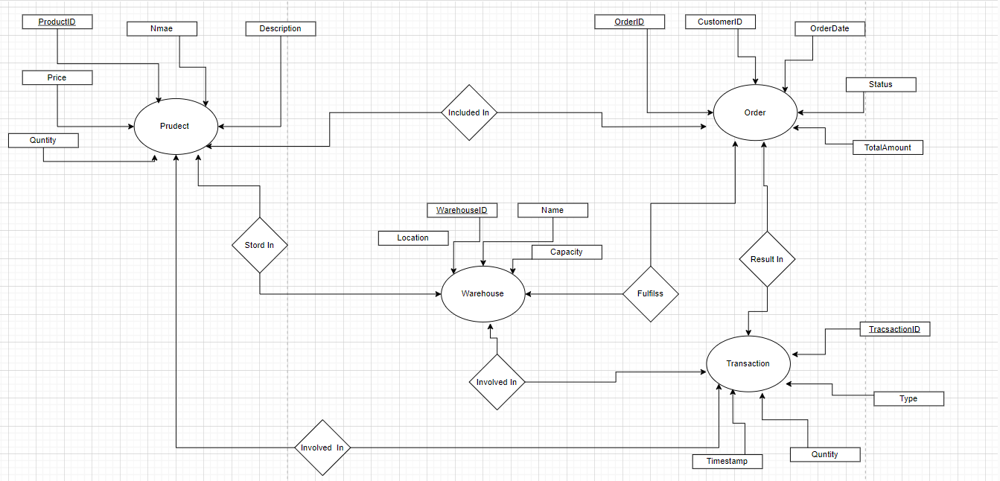

## Inventory Management System Entity-Relationship Diagram

### Description

The Inventory Management System (IMS) Entity-Relationship Diagram (ERD) illustrates the structure and relationships among key entities within the IMS. This diagram provides a visual representation of how products, warehouses, orders, and transactions interact within the system.

### Entities

1. **Product**: Represents individual products available in the inventory. Each product is characterized by attributes such as ProductID, Name, Description, Price, and Quantity.

2. **Warehouse**: Represents physical locations where inventory items are stored. Warehouses have attributes including WarehouseID, Name, Location, and Capacity.

3. **Order**: Represents customer orders placed for products. Each order is identified by attributes such as OrderID, CustomerID, OrderDate, Status, and TotalAmount.

4. **Transaction**: Represents inventory-related transactions such as purchases, sales, or transfers. Transactions are identified by attributes including TransactionID, Type, Quantity, and Timestamp.

### Relationships

- **Product - Order**: Indicates that products can be included in one or more orders, representing the products purchased by customers.

- **Product - Warehouse**: Indicates that products can be stored in one or more warehouses, representing the physical locations where products are kept.

- **Product - Transaction**: Indicates that products can be involved in one or more transactions, representing inventory movements or changes.

- **Warehouse - Transaction**: Indicates that warehouses can be involved in one or more transactions, representing inventory-related activities within warehouses.

- **Warehouse - Order**: Indicates that warehouses can fulfill one or more orders, representing the process of shipping products from warehouses to fulfill orders.

- **Order - Transaction**: Indicates that orders can result in one or more transactions, representing inventory changes resulting from order fulfillment.

### Usage

The IMS ERD serves as a reference for understanding the structure and relationships within the Inventory Management System. It aids developers, stakeholders, and users in comprehending how different components of the system interact and function.




# Products table

| ID | HTTP Request | (Method URI) | Operation Description | HTTP Status Codes | Request Sample | Response Sample |
|----|--------------|--------------|-----------------------|-------------------|----------------|-----------------|
| 1  | POST         | /products    | Create a Product      | 201 (Created): The product is successfully created. <br> 400 (Bad Request): The request is invalid. <br> 409 (Conflict): A product with the same ID already exists. | ```json { "name": "Smartphone", "description": "High-performance smartphone with advanced features", "price": 599.99, "quantity": 100 } ``` | ```json { "productId": 1, "name": "Smartphone", "description": "High-performance smartphone with advanced features", "price": 599.99, "quantity": 100 } ``` |
| 2  | GET          | /products    | Retrieve all Products | 200 (OK): Successfully retrieved the list of products. <br> 404 (Not Found): No products found. | - | ```json [ { "productId": 1, "name": "Smartphone", "description": "High-performance smartphone with advanced features", "price": 599.99, "quantity": 100 }, { "productId": 2, "name": "TV", "description": "High-performance TV with advanced features", "price": 799.99, "quantity": 50 } ] ``` |
| 3  | GET          | /products/{id} | Retrieve a Product  | 200 (OK): Successfully retrieved the product details. <br> 404 (Not Found): Product with the given ID not found. | - | ```json { "productId": 1, "name": "Smartphone", "description": "High-performance smartphone with advanced features", "price": 599.99, "quantity": 100 } ``` |
| 4  | PUT          | /products/{id} | Update a Product    | 200 (OK): Product details successfully updated. <br> 400 (Bad Request): The request is invalid. <br> 404 (Not Found): Product with the given ID not found. | ```json { "name": "Updated Smartphone", "description": "Updated description of smartphone", "price": 699.99, "quantity": 150 } ``` | ```json { "productId": 1, "name": "Updated Smartphone", "description": "Updated description of smartphone", "price": 699.99, "quantity": 150 } ``` |
| 5  | PATCH        | /products/{id} | Update a Product partially | 200 (OK): Product details successfully updated. <br> 400 (Bad Request): The request is invalid. <br> 404 (Not Found): Product with the given ID not found. | ```json { "price": 649.99 } ``` | ```json { "productId": 1, "name": "Smartphone", "description": "High-performance smartphone with advanced features", "price": 649.99, "quantity": 100 } ``` |
| 6  | DELETE       | /products/{id} | Delete a Product    | 204 (No Content): Product successfully deleted. <br> 404 (Not Found): Product with the given ID not found. | - | - |

# Warehouses table

| ID | HTTP Request | (Method URI) | Operation Description | HTTP Status Codes | Request Sample | Response Sample |
|----|--------------|--------------|-----------------------|-------------------|----------------|-----------------|
| 1  | POST         | /warehouses  | Create a Warehouse   | 201 (Created): The warehouse is successfully created. <br> 400 (Bad Request): The request is invalid. <br> 409 (Conflict): A warehouse with the same ID already exists. | ```json { "name": "Warehouse A", "location": "New York", "capacity": 1000 } ``` | ```json { "warehouseId": 1, "name": "Warehouse A", "location": "New York", "capacity": 1000 } ``` |
| 2  | GET          | /warehouses  | Retrieve all Warehouses | 200 (OK): Successfully retrieved the list of warehouses. <br> 404 (Not Found): No warehouses found. | - | ```json [ { "warehouseId": 1, "name": "Warehouse A", "location": "New York", "capacity": 1000 }, { "warehouseId": 2, "name": "Warehouse B", "location": "Los Angeles", "capacity": 1500 } ] ``` |
| 3  | GET          | /warehouses/{id} | Retrieve a Warehouse | 200 (OK): Successfully retrieved the warehouse details. <br> 404 (Not Found): Warehouse with the given ID not found. | - | ```json { "warehouseId": 1, "name": "Warehouse A", "location": "New York", "capacity": 1000 } ``` |
| 4  | PUT          | /warehouses/{id} | Update a Warehouse | 200 (OK): Warehouse details successfully updated. <br> 400 (Bad Request): The request is invalid. <br> 404 (Not Found): Warehouse with the given ID not found. | ```json { "name": "Updated Warehouse A", "location": "Updated location", "capacity": 1200 } ``` | ```json { "warehouseId": 1, "name": "Updated Warehouse A", "location": "Updated location", "capacity": 1200 } ``` |
| 5  | PATCH        | /warehouses/{id} | Update a Warehouse partially | 200 (OK): Warehouse details successfully updated. <br> 400 (Bad Request): The request is invalid. <br> 404 (Not Found): Warehouse with the given ID not found. | ```json { "capacity": 1300 } ``` | ```json { "warehouseId": 1, "name": "Warehouse A", "location": "New York", "capacity": 1300 } ``` |
| 6  | DELETE       | /warehouses/{id} | Delete a Warehouse | 204 (No Content): Warehouse successfully deleted. <br> 404 (Not Found): Warehouse with the given ID not found. | - | - |

# Orders table

| ID | HTTP Request | (Method URI) | Operation Description | HTTP Status Codes | Request Sample | Response Sample |
|----|--------------|--------------|-----------------------|-------------------|----------------|-----------------|
| 1  | POST         | /orders      | Create an Order       | 201 (Created): The order is successfully created. <br> 400 (Bad Request): The request is invalid. | ```json { "customerId": 123, "orderDate": "2024-04-08", "status": "Processing", "totalAmount": 799.99, "productId": 1, "warehouseId": 1 } ``` | ```json { "orderId": 1, "customerId": 123, "orderDate": "2024-04-08", "status": "Processing", "totalAmount": 799.99, "product": { "productId": 1, "name": "Smartphone", "description": "High-performance smartphone with advanced features", "price": 599.99, "quantity": 100 }, "warehouse": { "warehouseId": 1, "name": "Warehouse A", "location": "New York", "capacity": 1000 } } ``` |
| 2  | GET          | /orders      | Retrieve all Orders   | 200 (OK): Successfully retrieved the list of orders. <br> 404 (Not Found): No orders found. | - | ```json [ { "orderId": 1, "customerId": 123, "orderDate": "2024-04-08", "status": "Processing", "totalAmount": 799.99, "product": { "productId": 1, "name": "Smartphone", "description": "High-performance smartphone with advanced features", "price": 599.99, "quantity": 100 }, "warehouse": { "warehouseId": 1, "name": "Warehouse A", "location": "New York", "capacity": 1000 } }, { "orderId": 2, "customerId": 456, "orderDate": "2024-04-09", "status": "Shipped", "totalAmount": 699.99, "product": { "productId": 2, "name": "TV", "description": "High-performance TV with advanced features", "price": 799.99, "quantity": 50 }, "warehouse": { "warehouseId": 2, "name": "Warehouse B", "location": "Los Angeles", "capacity": 1500 } } ] ``` |
| 3  | GET          | /orders/{id} | Retrieve an Order    | 200 (OK): Successfully retrieved the order details. <br> 404 (Not Found): Order with the given ID not found. | - | ```json { "orderId": 1, "customerId": 123, "orderDate": "2024-04-08", "status": "Processing", "totalAmount": 799.99, "product": { "productId": 1, "name": "Smartphone", "description": "High-performance smartphone with advanced features", "price": 599.99, "quantity": 100 }, "warehouse": { "warehouseId": 1, "name": "Warehouse A", "location": "New York", "capacity": 1000 } } ``` |
| 4  | PUT          | /orders/{id} | Update an Order      | 200 (OK): Order details successfully updated. <br> 400 (Bad Request): The request is invalid. <br> 404 (Not Found): Order with the given ID not found. | ```json { "status": "Shipped" } ``` | ```json { "orderId": 1, "customerId": 123, "orderDate": "2024-04-08", "status": "Shipped", "totalAmount": 799.99, "product": { "productId": 1, "name": "Smartphone", "description": "High-performance smartphone with advanced features", "price": 599.99, "quantity": 100 }, "warehouse": { "warehouseId": 1, "name": "Warehouse A", "location": "New York", "capacity": 1000 } } ``` |
| 5  | PATCH        | /orders/{id} | Update an Order partially | 200 (OK): Order details successfully updated. <br> 400 (Bad Request): The request is invalid. <br> 404 (Not Found): Order with the given ID not found. | ```json { "status": "Cancelled" } ``` | ```json { "orderId": 1, "customerId": 123, "orderDate": "2024-04-08", "status": "Cancelled", "totalAmount": 799.99, "product": { "productId": 1, "name": "Smartphone", "description": "High-performance smartphone with advanced features", "price": 599.99, "quantity": 100 }, "warehouse": { "warehouseId": 1, "name": "Warehouse A", "location": "New York", "capacity": 1000 } } ``` |
| 6  | DELETE       | /orders/{id} | Delete an Order      | 204 (No Content): Order successfully deleted. <br> 404 (Not Found): Order with the given ID not found. | - | - |

# Transactions table

| ID | HTTP Request | (Method URI) | Operation Description | HTTP Status Codes | Request Sample | Response Sample |
|----|--------------|--------------|-----------------------|-------------------|----------------|-----------------|
| 1  | POST         | /transactions | Create a Transaction | 201 (Created): The transaction is successfully created. <br> 400 (Bad Request): The request is invalid. | ```json { "type": "In", "quantity": 50, "productId": 1, "warehouseId": 1 } ``` | ```json { "transactionId": 1, "type": "In", "quantity": 50, "timestamp": "2024-04-08T10:00:00Z", "product": { "productId": 1, "name": "Smartphone", "description": "High-performance smartphone with advanced features", "price": 599.99, "quantity": 150 }, "warehouse": { "warehouseId": 1, "name": "Warehouse A", "location": "New York", "capacity": 1000 } } ``` |
| 2  | GET          | /transactions | Retrieve all Transactions | 200 (OK): Successfully retrieved the list of transactions. <br> 404 (Not Found): No transactions found. | - | ```json [ { "transactionId": 1, "type": "In", "quantity": 50, "timestamp": "2024-04-08T10:00:00Z", "product": { "productId": 1, "name": "Smartphone", "description": "High-performance smartphone with advanced features", "price": 599.99, "quantity": 150 }, "warehouse": { "warehouseId": 1, "name": "Warehouse A", "location": "New York", "capacity": 1000 } }, { "transactionId": 2, "type": "Out", "quantity": 30, "timestamp": "2024-04-08T14:00:00Z", "product": { "productId": 1, "name": "Smartphone", "description": "High-performance smartphone with advanced features", "price": 599.99, "quantity": 120 }, "warehouse": { "warehouseId": 1, "name": "Warehouse A", "location": "New York", "capacity": 1000 } } ] ``` |
| 3  | GET          | /transactions/{id} | Retrieve a Transaction | 200 (OK): Successfully retrieved the transaction details. <br> 404 (Not Found): Transaction with the given ID not found. | - | ```json { "transactionId": 1, "type": "In", "quantity": 50, "timestamp": "2024-04-08T10:00:00Z", "product": { "productId": 1, "name": "Smartphone", "description": "High-performance smartphone with advanced features", "price": 599.99, "quantity": 150 }, "warehouse": { "warehouseId": 1, "name": "Warehouse A", "location": "New York", "capacity": 1000 } } ``` |
| 4  | PUT          | /transactions/{id} | Update a Transaction | 200 (OK): Transaction details successfully updated. <br> 400 (Bad Request): The request is invalid. <br> 404 (Not Found): Transaction with the given ID not found. | ```json { "type": "Out", "quantity": 30 } ``` | ```json { "transactionId": 1, "type": "Out", "quantity": 30, "timestamp": "2024-04-08T10:00:00Z", "product": { "productId": 1, "name": "Smartphone", "description": "High-performance smartphone with advanced features", "price": 599.99, "quantity": 120 }, "warehouse": { "warehouseId": 1, "name": "Warehouse A", "location": "New York", "capacity": 1000 } } ``` |
| 5  | PATCH        | /transactions/{id} | Update a Transaction partially | 200 (OK): Transaction details successfully updated. <br> 400 (Bad Request): The request is invalid. <br> 404 (Not Found): Transaction with the given ID not found. | ```json { "quantity": 40 } ``` | ```json { "transactionId": 1, "type": "In", "quantity": 40, "timestamp": "2024-04-08T10:00:00Z", "product": { "productId": 1, "name": "Smartphone", "description": "High-performance smartphone with advanced features", "price": 599.99, "quantity": 190 }, "warehouse": { "warehouseId": 1, "name": "Warehouse A", "location": "New York", "capacity": 1000 } } ``` |
| 6  | DELETE       | /transactions/{id} | Delete a Transaction | 204 (No Content): Transaction successfully deleted. <br> 404 (Not Found): Transaction with the given ID not found. | - | - |


# my API 
https://app.swaggerhub.com/apis/yazanzidan/Inventory-Management-System/3.1.0
